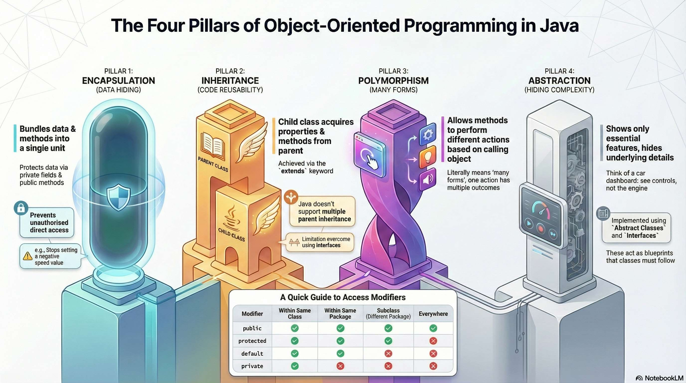

# kintsugi-stack-java
> Write once, run anywhere.


- Author: [Kintsugi-Programmer](https://github.com/kintsugi-programmer)

> Disclaimer: The content presented here is a curated blend of my personal learning journey, experiences, open-source documentation, and invaluable knowledge gained from diverse sources. I do not claim sole ownership over all the material; this is a community-driven effort to learn, share, and grow together.

## Table of Contents
- [kintsugi-stack-java](#kintsugi-stack-java)
  - [Table of Contents](#table-of-contents)
  - [Introduction to Java](#introduction-to-java)
    - [What is Java?](#what-is-java)
    - [Why Java is Platform Independent?](#why-java-is-platform-independent)
    - [Java Installation \& Components](#java-installation--components)
    - [JDK, JRE, and JVM Relationship](#jdk-jre-and-jvm-relationship)
    - [JDK (Java Development Kit)](#jdk-java-development-kit)
    - [JRE (Java Runtime Environment)](#jre-java-runtime-environment)
    - [JVM (Java Virtual Machine)](#jvm-java-virtual-machine)
    - [Java Program Execution Process](#java-program-execution-process)
  - [Basic Java Program Structure](#basic-java-program-structure)
    - [VSC Setup](#vsc-setup)
    - [Basic Skeleton](#basic-skeleton)
    - [Main Method Breakdown](#main-method-breakdown)
    - [Print Statements](#print-statements)
    - [System.out Explanation](#systemout-explanation)
    - [Statement Termination](#statement-termination)
    - [Objects](#objects)
    - [IDE Usage: Packages and Organization](#ide-usage-packages-and-organization)
  - [Data Types](#data-types)
    - [Primitive Data Types](#primitive-data-types)
      - [Integral Data Types](#integral-data-types)
      - [Floating Point (Decimal Numbers) Data Types](#floating-point-decimal-numbers-data-types)
      - [Boolean Data Type](#boolean-data-type)
      - [Character Data Type](#character-data-type)
    - [Data Type Ranges](#data-type-ranges)
      - [Checking Min/Max Values](#checking-minmax-values)
    - [Primitive vs. Wrapper Classes](#primitive-vs-wrapper-classes)
    - [Type Conversion](#type-conversion)
      - [**Widening** Conversion (Implicit/Automatic)](#widening-conversion-implicitautomatic)
      - [Narrowing Conversion (Explicit/Manual)](#narrowing-conversion-explicitmanual)
  - [String Class (Strings)](#string-class-strings)
    - [String Creation Methods](#string-creation-methods)
    - [Memory Management (Stack, Heap, and String Pool)](#memory-management-stack-heap-and-string-pool)
    - [String Comparison](#string-comparison)
    - [String Immutability](#string-immutability)
    - [Common String Methods](#common-string-methods)
  - [Operators](#operators)
    - [Arithmetic Operators](#arithmetic-operators)
    - [Compound Assignment Operators](#compound-assignment-operators)
    - [Increment/Decrement Operators](#incrementdecrement-operators)
    - [Relational Operators](#relational-operators)
    - [Logical Operators](#logical-operators)
    - [Bitwise Operators](#bitwise-operators)
  - [Control Statements](#control-statements)
    - [If Statements](#if-statements)
    - [Switch Statements](#switch-statements)
    - [Ternary Operator](#ternary-operator)
  - [Loops](#loops)
    - [While Loop](#while-loop)
    - [For Loop](#for-loop)
      - [For Loop Components](#for-loop-components)
    - [Do-While Loop](#do-while-loop)
    - [Enhanced For Loop (For-Each)](#enhanced-for-loop-for-each)
  - [Arrays](#arrays)
    - [Array Declaration and Creation](#array-declaration-and-creation)
    - [Array Indexing](#array-indexing)
    - [Array Operations](#array-operations)
    - [Array Characteristics](#array-characteristics)
  - [Object-Oriented Programming](#object-oriented-programming)
    - [Key Pillars of OOPs](#key-pillars-of-oops)
    - [Classes and Objects](#classes-and-objects)
      - [Class Definition](#class-definition)
      - [Object Creation and Usage](#object-creation-and-usage)
    - [Constructors](#constructors)
      - [Default Constructor](#default-constructor)
      - [Parameterized Constructor](#parameterized-constructor)
      - [Constructor Overloading](#constructor-overloading)
    - [Method Overloading](#method-overloading)
  - [Advanced OOP Concepts](#advanced-oop-concepts)
    - [Encapsulation](#encapsulation)
    - [Inheritance](#inheritance)
    - [Polymorphism (Many Forms)](#polymorphism-many-forms)
      - [Compile-Time Polymorphism (Method Overloading)](#compile-time-polymorphism-method-overloading)
      - [Run-Time Polymorphism (Method Overriding)](#run-time-polymorphism-method-overriding)
    - [Abstraction](#abstraction)
      - [Abstract Classes](#abstract-classes)
      - [Interfaces](#interfaces)
      - [Interface Features (Java 8+)](#interface-features-java-8)
    - [Access Modifiers](#access-modifiers)
  - [Multithreading](#multithreading)
    - [Core Concepts](#core-concepts)
    - [Creating and Running Threads](#creating-and-running-threads)
    - [Shared Resources and Synchronization](#shared-resources-and-synchronization)
  - [Exception Handling](#exception-handling)
    - [Try-Catch-Finally Structure](#try-catch-finally-structure)
  - [Collections Framework](#collections-framework)
    - [Interfaces Hierarchy](#interfaces-hierarchy)
    - [List Interface](#list-interface)
      - [ArrayList](#arraylist)
      - [LinkedList](#linkedlist)
    - [Set Interface](#set-interface)
      - [HashSet](#hashset)
      - [LinkedHashSet](#linkedhashset)
    - [Map Interface](#map-interface)
      - [HashMap](#hashmap)
    - [Collection Framework Guide](#collection-framework-guide)
      - [When to Use What?](#when-to-use-what)
      - [Common Methods](#common-methods)
  - [Others](#others)
    - [Java Memory Management](#java-memory-management)
    - [Important Keywords](#important-keywords)
    - [Best Practices](#best-practices)

## Introduction to Java


### What is Java?
- **Java** is an **Object-Oriented Programming Language**
- Known for its **"Write Once, Run Anywhere" (WORA)** capability
- **Platform Independent** - requires only JVM (Java Virtual Machine) to be installed on the target machine
- Code runs on any machine that has JVM installed

### Why Java is Platform Independent?
When you compile a Java program:
1. `.java` file → compiled by `javac` compiler → `.class` file (contains bytecode)
2. Bytecode can run on any machine with JVM installed
3. JVM converts bytecode to native machine code

### Java Installation & Components

> Installing Java, means installing JDK

```bash
sudo apt update
sudo apt install openjdk-17-jdk
```

### JDK, JRE, and JVM Relationship
```
JDK (Java Development Kit)
├── JRE (Java Runtime Environment)
│   └── JVM (Java Virtual Machine)
└── Development Tools (javac, debugger, etc.)
```

>  **JDK contains JRE, which contains JVM**.

### JDK (Java Development Kit)
- **Purpose**: Tools for developers to write Java code
- **Contains**:
  - Java compiler (`javac`)
  - Documentation generator
  - Debugger
  - Core classes source code
  - JRE

### JRE (Java Runtime Environment) 
- **Purpose**: Environment to run Java applications
- **Contains**:
  - Compiled core classes
  - Supporting files
  - Configuration files (memory allocation settings)
  - JVM

> It(JRE) does **not** contain development tools.

### JVM (Java Virtual Machine)
- **Purpose**: The actual engine where Java programs execute
- Converts bytecode to native machine code
- Platform-specific component

### Java Program Execution Process
```
1. Write code → .java file
2. Compile with javac → .class file (bytecode)
3. Execute with JVM → native machine code
```

Execution involves three main steps.

1.  **Code Writing:** The developer writes code in a file with the `.java` extension (e.g., `Test.java`).
2.  **Compilation:** The `javac` compiler takes the `.java` file and converts it into a **`.class` file**.
    *   The `.class` file contains **Bytecode**.
    *   This Bytecode is **platform independent**.
3.  **Execution:** Execution is handled by the **JVM**.
    *   The JVM reads and understands the Bytecode.
    *   It converts the Bytecode into **Native Code** (machine code, zeros and ones) so the program can run on the specific machine.

## Basic Java Program Structure

```java
// package com.kintsugistack.javaessentials; // used at serious java project, rn vsc java extension is handling .java process to .class, etc etc to direct simple run ;)

public class App {// Class
    public static void main(String[] args){ // Main Method/Runner/Driver Code
        System.out.println("I am Kintsugi-Programmer");

    }
}
```
### VSC Setup
- Install VSC JAVA Ext. Pack
```md
## Getting Started

Welcome to the VS Code Java world. Here is a guideline to help you get started to write Java code in Visual Studio Code.

## Folder Structure

The workspace contains two folders by default, where:

- `src`: the folder to maintain sources
- `lib`: the folder to maintain dependencies

Meanwhile, the compiled output files will be generated in the `bin` folder by default.

> If you want to customize the folder structure, open `.vscode/settings.json` and update the related settings there.

## Dependency Management

The `JAVA PROJECTS` view allows you to manage your dependencies. More details can be found [here](https://github.com/microsoft/vscode-java-dependency#manage-dependencies).
```
### Basic Skeleton

> everything we write in java is inside class !!!

```java
class Test {
    public static void main(String[] args) { // Main Method/Runner/Driver Code
        // Your code here
        System.out.println("Hello World");
    }
}
```

**Class:** The basic meaning of a Class is a **blueprint** or design. For example, the design of a house is the class.

### Main Method Breakdown

**Main Method:** `public static void main(String[] args)` is the **main thing**. This is the **entry point**—the method understood by the JVM. The signature must be written **exactly as it is**.

*   **`public`:** An **Access Modifier** meaning it can be accessed by anyone outside the class.
*   **`static`:** Means the method is associated with the class `where it resides`, and you **do not need to create an object** to access it.
*   **`void`:** Means the method **does not return anything**.
*   **`main`:** The name of the method understood by the JVM.
*   **`String[] args`:** Allows passing **parameters** (arguments) into the code.

### Print Statements
```java
System.out.println("Hello World");  // Prints with new line
System.out.print("Hello");          // Prints without new line
```

### System.out Explanation
To print something to the console, use `System.out.println("Hello World")`.

*   **`System`:** A class in Java.
*   **`out`:** An **instance** (object) of the `PrintStream` class, which represents the console.
*   **`println`:** A method used to print content to the console.

### Statement Termination
Every statement in Java **must end with a semicolon (`;`)**.

### Objects
An **Object** is an actual instance of a Class. For example, the house built from the blueprint is the object. Objects can be instantiated from a class.

### IDE Usage: Packages and Organization

An IDE (Integrated Development Environment), such as IntelliJ, is used to write code.

*   **Packages:** Act like **folders** for organizing code.
*   **Naming Convention:** Packages are often named in a reverse fashion of a domain (e.g., `com.okey.javaInOneVideo`). Package names should generally be in **small case**.
*   **Structure:** Packages can represent different sections of the course, such as `dataTypes`, `controlFlow`, `oops`, `multiThreading`, and `collectionFramework`.

## Data Types


```java
```
When declaring variables, the type must be specified (e.g., `int a = 1`).
### Primitive Data Types

> as java have some primitive stuff, it's NOT PURE OPPS Lang.

#### Integral Data Types
Integral numbers are numbers without a decimal point. There are four types, differentiated by their ranges:

| Data Type | Memory Usage | Range Details | Notes |
| :--- | :--- | :--- | :--- |
| `byte` | 1 byte | Minimum: -128; Maximum: 127 | Storing values outside this range results in an error. |
| `short` | More bytes | Range is slightly larger than `byte`. | For larger numbers than `byte`. |
| `int` | | Used for storing standard integers. | |
| `long` | | Used for storing numbers larger than `int`. | Literals must be suffixed with `L` (e.g., `123456L`) to prevent the default assumption that the number is an `int`. |

```java
byte a = 1;     // Range: -128 to 127 (1 byte)
short b = 2;    // Range: -32,768 to 32,767 (2 bytes)
int c = 3;      // Range: -2³¹ to 2³¹-1 (4 bytes)
long d = 4L;    // Range: -2⁶³ to 2⁶³-1 (8 bytes)
```

**Important Notes:**
- Add 'L' suffix for long literals
- Default integral type is `int`, i.e. default number datatype is integer.
- Each type has different memory allocation

#### Floating Point (Decimal Numbers) Data Types
Used for numbers containing decimal points.

| Data Type | Precision | Use Case |
| :--- | :--- | :--- |
| `float` | Around **seven significant digits**. | Used for scientific notation or approximate values. Values exceeding 7 digits will be rounded off. |
| `double` | Around **15 significant digits**. | Used when more precision is required than `float`. |

*   **`float` Min/Max:** Can store data close to zero (e.g., $10^{-45}$) and up to large numbers (e.g., $10^{38}$).

```java
float e = 3.14f;    // ~7 significant digits (4 bytes)
double f = 3.14159; // ~15 significant digits (8 bytes)
```

> if exceed limits, it will get rounded-off

**Important Notes:**
- Add 'f' suffix for float literals
- Default decimal type is `double`
- Use for approximate values, not precise calculations

#### Boolean Data Type
Used to store only two values: **True or False**.

*   **Values:** `true` or `false`.
*   **Size:** Takes **one bit** (True=1, False=0).

```java
boolean isAdult = true;   // Only true or false
boolean isSunny = false;  // 1 bit storage
```

#### Character Data Type
Used to store a **single character**.

*   **Syntax:** Use single quotes (e.g., `char n = 'n'`).
*   **Integer Mapping:** Every character in Java is mapped to an **integer value**. This value can be retrieved using type casting (e.g., `(int)n`).
*   **Range:** Minimum value is 0; Maximum value is 65535. Java can store 65,536 different characters.
*   **Content:** Can store English characters, symbols, emojis, and special characters.
*   **ASCII:** The range 0 to 127 is a subset known as ASCII, which includes English alphabets (upper and lower case), space, enter, and backspace.

```java
char grade = 'A';        // Single character (2 bytes)
char symbol = '★';       // Can store symbols
char hindi = 'अ';        // Can store Unicode characters
```

**Character Features:**
- Range: 0 to 65,535 (Unicode values)
- Can convert to integer: `(int) grade` gives ASCII value
- Supports all languages and symbols

### Data Type Ranges

#### Checking Min/Max Values
```java
System.out.println("Byte min: " + Byte.MIN_VALUE);      // -128
System.out.println("Byte max: " + Byte.MAX_VALUE);      // 127
System.out.println("Int min: " + Integer.MIN_VALUE);    
System.out.println("Int max: " + Integer.MAX_VALUE);    
System.out.println("Float min: " + Float.MIN_VALUE);    
System.out.println("Float max: " + Float.MAX_VALUE);    
```
### Primitive vs. Wrapper Classes

> int != Integer

| Feature | Primitive Data Type (`int`, `char`, `float`) | Wrapper Class (`Integer`, `Character`, `Float`) |
| :--- | :--- | :--- |
| **Nature** | Not a Class. | A Class. |
| **OOP Status** | Their existence means Java is **not a purely Object-Oriented** language. | Provides fields and methods (e.g., `Integer.MAX_VALUE`). |
| **Usage** | Standard variable storage. | Used by Collection framework classes. Provides more flexibility. |

### Type Conversion

#### **Widening** Conversion (Implicit/Automatic)
```java
byte byteVal = 10;
short shortVal = byteVal;    // OK - smaller to larger
int intVal = shortVal;       // OK - smaller to larger  
long longVal = intVal;       // OK - smaller to larger
float floatVal = longVal;    // OK - int to float
double doubleVal = floatVal; // OK - float to double
```
*   **Concept:** Converting a **smaller** data type to a **larger** data type.
*   **Mechanism:** This conversion happens **automatically** (implicitly).
*   **Examples:** `byte` to `short`, `int` to `long`, `long` to `float`, `float` to `double`.
*   **Result:** No data loss occurs.

#### Narrowing Conversion (Explicit/Manual)
```java
double doubleVal = 123.456;
float floatVal = (float) doubleVal;    // Explicit cast needed
long longVal = (long) floatVal;       // Explicit cast needed
int intVal = (int) longVal;           // Explicit cast needed
```
*   **Concept:** Converting a **larger** data type to a **smaller** data type.
*   **Mechanism:** This must be explicitly done by the developer (e.g., casting `(long)`).
*   **Reason:** Converting a larger container (like a bucket) into a smaller one (like a jug) can cause **overflow and data loss** (e.g., loss of the decimal part when converting `float` to `long`).

## String Class (Strings)


**String** is a **Class**, not a primitive data type.

### String Creation Methods
```java
String str1 = "hello"; // 1
String str2 = new String("hello"); // 2
```

1.  **Direct Literal:** By directly assigning a value in double quotes.

    ```java
    String s1 = "Hello"; 
    // Method 1: String Literal
    // Uses the String Pool
    ```

2.  **Constructor:** Using the `new` keyword.

    ```java
    String s3 = new String("Hello");
    // Method 2: Using new keyword
    // Creates a new object in the Heap memory
    ```

### Memory Management (Stack, Heap, and String Pool)

The JVM uses two main spaces for data storage: **Stack** and **Heap**.

*   **Stack:** Stores data for primitive type variables (e.g., the value `1` for `int a = 1`).
*   **Heap:** Where objects created using the `new` keyword are stored.
    *   **String Pool:** A specific part of the Heap memory where **String Literals** reside.
        *   **String Pool**: Special area in heap memory for string literals
        *   Literals are reused to save memory
        *   `new String()` creates object in heap (outside string pool)
        *   **Reusability:** The String Pool checks if a literal already exists. If it does, subsequent uses of the same literal will reference the existing string object for **re-use**, preventing the creation of new objects.
*   **References:** Variables holding objects (like `s1` or `s2`) store the **address** (reference) of the object in memory, not the direct value.

### String Comparison
```java
String str1 = "hello";
String str2 = "hello";
String str3 = new String("hello");

// Reference comparison
str1 == str2;        // true (both point to same object in string pool)
str1 == str3;        // false (different memory locations)

// Content comparison  
str1.equals(str2);   // true (same content)
str1.equals(str3);   // true (same content)
```
*   **Reference Comparison (`==`):** Using `==` on String objects compares their **references** (addresses).
    *   `s1 == s2` (both literals, same value, same pool reference) yields `True`.
    *   `s1 == s3` (s3 created with `new`, different memory location) yields `False`.
*   **Value Comparison (`.equals()`):** To check if the **content** of two strings is the same, use the `.equals()` method. This method checks if every character is the same.

### String Immutability
```java
String a = "hello";
a.toUpperCase();     // Creates new string, doesn't modify 'a'
System.out.println(a); // Still prints "hello"

// To modify, reassign
a = a.toUpperCase(); // Now 'a' points to "HELLO"
```
*   **Immutability:** String is **immutable**. Operations like `toUpperCase()` or `substring()` **create a new String** rather than changing the existing one. Reassigning the variable is necessary to point it to the new string (`a = a.toUpperCase()`).

### Common String Methods
```java
String text = "Hello World";

// Length
text.length();              // 11

// Character at index
text.charAt(0);             // 'H'

// Substring
text.substring(0, 5);       // "Hello"

// Contains
text.contains("World");     // true

// Replace
text.replace("World", "Java"); // "Hello Java"

// Case conversion
text.toUpperCase();         // "HELLO WORLD"
text.toLowerCase();         // "hello world"
```
*   `toUpperCase()`
*   `toLowerCase()`
*   `length()`
*   `charAt(index)` (uses zero-based indexing to find a character).
*   `substring()` (extracts a part of the string).
*   `contains("text")` (checks if a substring exists).
*   `replace()` (replaces characters/substrings).

## Operators


### Arithmetic Operators
Used for mathematical calculations.
*   `+` (Addition)
*   `-` (Subtraction)
*   `*` (Multiplication)
*   `/` (Division)
*   `%` (Modulo/Remainder)

```java
int a = 10, b = 3;

int sum = a + b;        // 13 (Addition)
int diff = a - b;       // 7  (Subtraction)  
int product = a * b;    // 30 (Multiplication)
int quotient = a / b;   // 3  (Division - integer result)
int remainder = a % b;  // 1  (Modulo)

// For decimal result
double result = (double) a / b; // 3.333...
```
**Integer Division:** If division is performed on two integers (`10 / 3`), the result will be an integer (`3`). To achieve floating-point division, one of the operands must be a float or double (e.g., `10.0 / 3`).
### Compound Assignment Operators
**Compound Assignment Shorthand:** `a = a + 5` can be shortened to `a += 5`. Similar forms exist for subtraction (`-=`), multiplication (`*=`), division (`/=`), and modulo (`%=`).
```java
int a = 10;
a += 5;  // Same as: a = a + 5  → a becomes 15
a -= 3;  // Same as: a = a - 3  → a becomes 12
a *= 2;  // Same as: a = a * 2  → a becomes 24
a /= 4;  // Same as: a = a / 4  → a becomes 6
a %= 4;  // Same as: a = a % 4  → a becomes 2
```

### Increment/Decrement Operators
These operators add or subtract one from a variable.

```java
int z = 1;

// Post-increment: use current value, then increment
int result1 = z++;  // result1 = 1, z becomes 2

// Pre-increment: increment first, then use value  
int result2 = ++z;  // z becomes 3, result2 = 3

// Post-decrement: use current value, then decrement
int result3 = z--;  // result3 = 3, z becomes 2

// Pre-decrement: decrement first, then use value
int result4 = --z;  // z becomes 1, result4 = 1
```

| Operator | Name | Timing of Operation | Example Effect |
| :--- | :--- | :--- | :--- |
| `a++` | Post-Increment | Uses the existing value in the current expression, then increments it **afterward**. | `z = 1; x = z++;` -> x is 1, z becomes 2 |
| `++a` | Pre-Increment | Increments the value **before** it is used in the current expression. | `z = 1; x = ++z;` -> z becomes 2, x is 2 |
| `a--` | Post-Decrement | Uses the existing value, then decrements it. | |
| `--a` | Pre-Decrement | Decrements the value **before** it is used in the expression. | |

### Relational Operators
Return a **Boolean** result (`True` or `False`).
*   `<` (Less than)
*   `>` (Greater than)
*   `<=` (Less than or equal to)
*   `>=` (Greater than or equal to)
*   `==` (Equal to)
*   `!=` (Not equal to)

```java
int a = 5, b = 3;

a > b;    // true  (greater than)
a < b;    // false (less than)
a >= b;   // true  (greater than or equal)
a <= b;   // false (less than or equal)
a == b;   // false (equal to)
a != b;   // true  (not equal to)
```

### Logical Operators
Used to **combine two different conditions**. The output is always Boolean.

*   **Logical AND (`&&`):** Returns `True` only if **both** combined conditions are True.
*   **Logical OR (`||`):** Returns `True` if **any one** of the conditions is True.
*   **Logical NOT (`!`):** Inverts the boolean result (e.g., if A is False, `!A` is True).

```java
boolean isSunny = true;
boolean isWarm = true;

// Logical AND (&&) - both must be true
boolean goodBeachDay = isSunny && isWarm;  // true

// Logical OR (||) - at least one must be true
boolean badWeather = isRaining || isSnowing;  // true if either is true

// Logical NOT (!) - inverts the value
boolean notSunny = !isSunny;  // false
```

### Bitwise Operators
Used to perform operations on the **binary** representation of numbers (bits).

| Operator | Function | Result |
| :--- | :--- | :--- |
| `&` | Bitwise AND | 1 only if **both** bits are 1. |
| `|` | Bitwise OR | 1 if **at least one** bit is 1. |
| `^` | Bitwise XOR | 1 only if the two bits are **different**. |
| `~` | Bitwise NOT | Inverts the bits (0 becomes 1, 1 becomes 0). |
| `<<` | Left Shift | Shifts the bits to the left. |
| `>>` | Right Shift | Shifts the bits to the right. |

```java
int a = 5;   // Binary: 0101
int b = 3;   // Binary: 0011

// Bitwise AND (&)
int and = a & b;    // 0001 = 1

// Bitwise OR (|)  
int or = a | b;     // 0111 = 7

// Bitwise XOR (^)
int xor = a ^ b;    // 0110 = 6

// Bitwise NOT (~)
int not = ~a;       // Inverts all bits

// Left Shift (<<)
int leftShift = a << 1;  // 1010 = 10

// Right Shift (>>)
int rightShift = a >> 1; // 0010 = 2
```

## Control Statements


### If Statements
Used to execute code blocks based on conditions.

*   **If Block:** The code within the `if` block runs only if the condition evaluates to `True`.
*   **If-Else:** If the `if` condition is False, the `else` block runs.
*   **If-Else Ladder:** Uses `else if` to check multiple conditions sequentially.
    *   If a block contains only a single line of code, the curly brackets `{}` can be skipped.
```java
boolean isSunny = true;
boolean isWarm = true;

// Simple if
if (isSunny) {
    System.out.println("Good day!");
}

// If-else
if (isSunny && isWarm) {
    System.out.println("Beach day!");
} else {
    System.out.println("Stay home.");
}

// If-else-if ladder
if (isSunny && isWarm) {
    System.out.println("Beach day!");
} else if (isSunny) {
    System.out.println("Wear jacket and go to beach.");
} else {
    System.out.println("Stay home.");
}
```

### Switch Statements
Used to replace long, inefficient If-Else structures, especially when checking a variable against many possible values.

*   **Mechanism:** The `switch` statement **jumps directly** to the matching `case`, which is more efficient than checking every preceding condition sequentially (as in If-Else).
*   **Structure:**
    ```java
    switch (variable) {
        case value1: 
            // code
            break; // Essential
        // ... other cases
        default: 
            // code if no case matches
    }
    ```
*   **`break` Keyword:** **Essential**. If `break` is omitted, once a matching case is found, subsequent cases will also execute (fall-through behavior) until a `break` or the end of the switch block is reached. `break` causes execution to exit the switch block.
*   **`default`:** Executes if none of the defined cases match the variable's value.

```java
int day = 3;
String dayName;

switch (day) {
    case 1:
        dayName = "Monday";
        break;
    case 2:
        dayName = "Tuesday"; 
        break;
    case 3:
        dayName = "Wednesday";
        break;
    case 4:
        dayName = "Thursday";
        break;
    case 5:
        dayName = "Friday";
        break;
    case 6:
        dayName = "Saturday";
        break;
    case 7:
        dayName = "Sunday";
        break;
    default:
        dayName = "Invalid day";
        break;
}
```

**Important**: Always use `break` statements to prevent fall-through behavior.

### Ternary Operator
This is a **short shortcut for If-Else** statements.

*   **Syntax:**
    ```java
    Condition ? Statement_if_True : Statement_if_False
    ```
*   If the condition is True, the first statement runs; otherwise, the second statement runs.

```java
int a = 10;

// Syntax: condition ? valueIfTrue : valueIfFalse
String result = (a % 2 == 0) ? "Even" : "Odd";
System.out.println(result); // "Even"

// Can be used for assignment
boolean isEven = (a % 2 == 0) ? true : false;
```

## Loops


Loops are used when a task needs to be performed repeatedly.

### While Loop
Repeats a block of code as long as a condition remains True.

*   **Structure:**
    ```java
    int i = 1; // Variable declaration/initialization outside
    while (i <= 100) { 
        System.out.println("Hello"); 
        i++; // Incrementation inside // Don't forget to increment!
    }
    ```
*   If the counter variable (`i`) is not modified inside the loop, the loop will run **infinitely**.

### For Loop
A more structured loop where variable initialization, condition checking, and modification are done in one line.
```java
for (initialization; condition_check; increment) {
    // Code to be executed
}
```


*   **Structure:** The parentheses contain three parts, separated by semicolons.
    ```java
    // Syntax: for(initialization; condition; increment)
    for (int i = 0; i < 100; i++) {
        System.out.println("Hello " + i);
    }

    // Variable scope is limited to the loop
    // int i is not accessible outside the for loop
    ```

#### For Loop Components
1. **Initialization**: `int i = 0` - Executed only once at the start.
2. **Condition**: `i < 100` - Checked before every iteration.
3. **Increment**: `i++` - Executed after the loop body runs in each iteration. This step is optional and can be removed if the modification is done inside the body.

### Do-While Loop
```java
int i = 101;
do {
    System.out.println("Hello");
    i++;
} while (i <= 100);

// Executes at least once, even if condition is false initially
```
Similar to a `while` loop, but the code block is executed **at least once**, regardless of the condition, because the condition is checked at the end.

*   **Structure:**
    ```java
    do {
        // Code runs at least once
    } while (i <= 100); // Condition checked here
    ```


### Enhanced For Loop (For-Each)
A shortcut for iterating through all elements of an array.

*   **Mechanism:** In a standard `for` loop, the variable `i` acts as the index. In a For-Each loop, the variable (e.g., `i` below) acts as the element itself.

    ```java
    // Structure: for (Type element : array)
    for (int i : a) {
        System.out.println(i); // Prints the element value
    }
    ```

```java
int[] numbers = {1, 2, 3, 4, 5};

// Traditional for loop
for (int i = 0; i < numbers.length; i++) {
    System.out.println(numbers[i]);
}

// Enhanced for loop
for (int num : numbers) {
    System.out.println(num);
}
```

## Arrays


An array is a **data structure that stores a fixed size sequential collection of elements of the same type**.

### Array Declaration and Creation
```java
// Method 1: Declaration then creation
// Uses square brackets `[]`.
int[] arr;                    // Declaration
// The `new` keyword is used to create the array object in the Heap memory.
arr = new int[5];            // Creation with size 5

// Method 2: Combined declaration and creation  
// An `int` array is initialized by default with **zeros**.
int[] numbers = new int[5];  // Creates array with default values (0)

// Method 3: Initialize with values
int[] nums = {1, 2, 3, 4, 5};
```

*   **Declaration:** Uses square brackets `[]`.
    ```java
    int[] a; 
    ```
*   **Creation/Initialization (Fixed Size):** The `new` keyword is used to create the array object in the Heap memory.
    ```java
    a = new int; // Array size is 5
    ```
*   **Default Values:** An `int` array is initialized by default with **zeros**.
*   **Direct Initialization:** Can be done using curly brackets.
    ```java
    int[] a = {1, 2, 3};
    ```
### Array Indexing
*   **Indexing:** Arrays use **Zero-Based Indexing** (0, 1, 2, ...).
    *   Elements are accessed or modified using their index (e.g., `a = 55`).
```java
int[] arr = new int[5];  // Creates: [0, 0, 0, 0, 0]

// Zero-based indexing
arr[0] = 10;    // First element
arr[1] = 20;    // Second element  
arr[4] = 50;    // Last element

// Accessing elements
System.out.println(arr[0]);  // Prints: 10
```

### Array Operations
*   **Printing:** Arrays cannot be printed directly; they require a loop to iterate through all elements.
```java
int[] numbers = {10, 20, 30, 40, 50};

// Getting array length
int length = numbers.length;  // 5

// Printing all elements using for loop
for (int i = 0; i < numbers.length; i++) {
    System.out.println(numbers[i]);
}

// Printing using enhanced for loop
for (int num : numbers) {
    System.out.println(num);
}
```

### Array Characteristics
- **Fixed size**: Cannot change size after creation
- **Same data type**: All elements must be of same type
- **Zero-based indexing**: First element at index 0
- **Default values**: 
  - Numeric types: 0
  - Boolean: false
  - Objects: null

## Object-Oriented Programming


Java works primarily with Classes and Objects.

```java
// Example of a simple class and object
class Example {
    public static void main(String[] args) {
        Car myCar = new Car(); // Creating an object
        myCar.drive(); // Calling a method
    }
}
class Car {
    void drive() {
        System.out.println("Car is driving");
    }
}

```
### Key Pillars of OOPs
The four main pillars are Encapsulation, Inheritance, Polymorphism, and Abstraction.

### Classes and Objects
*   **Class:** A **blueprint** (design) for creating objects. A class defines **Fields** (variables/properties, e.g., car color, speed) and **Methods** (behaviors, e.g., car drive).

*   **Object:** A **real-world entity** and an **instance** of a class. Objects are created using the `new` keyword, which allocates memory in the Heap.
```java
class Car {
    String color; // Field
    int speed;
    
    void drive() { // Method
        System.out.println("Car is driving at speed: " + speed);
    }
}

class Main {
    public static void main(String[] args) {
        Car myCar = new Car(); // Object creation
        myCar.color = "Red";
        myCar.speed = 60;
        myCar.drive();
    }
}
```
#### Class Definition
```java
class Student {
    // Fields (attributes)
    String name;
    int rollNumber;
    int age;
    
    // Constructor
    Student(String name, int rollNumber, int age) {
        this.name = name;
        this.rollNumber = rollNumber;
        this.age = age;
    }
    
    // Methods (behaviors)
    void study() {
        System.out.println(name + " is studying.");
    }
    
    void displayInfo() {
        System.out.println("Name: " + name);
        System.out.println("Roll: " + rollNumber);
        System.out.println("Age: " + age);
    }
}
```

#### Object Creation and Usage
```java
// Creating objects
Student student1 = new Student("Alice", 101, 20);
Student student2 = new Student("Bob", 102, 21);

// Using objects
student1.study();           // Alice is studying.
student1.displayInfo();     // Displays Alice's info
student2.displayInfo();     // Displays Bob's info
```

### Constructors
A constructor is a method used specifically to **initialize a new object**.

*   **Default Constructor:** If no constructor is written, a hidden default constructor (with no arguments) is provided.
*   **Custom Constructor:** Can accept parameters to set initial field values when the object is created.
    ```java
    public Car(String color) {
        this.color = color; // Uses the 'this' keyword
    }
    ```
*   **`this` Keyword:** Refers to the current object being constructed or acted upon.
```java
class Car {
    String color;
    
    // Default Constructor
    Car() {
        color = "Unknown";
    }
    
    // Custom Constructor
    Car(String color) {
        this.color = color; // Using 'this' to refer to the current object's field
    }
    
    void display() {
        System.out.println("Car color: " + color);
    }
}

class Main {
    public static void main(String[] args) {
        Car car1 = new Car(); // Uses default constructor
        Car car2 = new Car("Blue"); // Uses custom constructor
        car1.display();
        car2.display();
    }
}
```
#### Default Constructor
```java
class Car {
    String brand;
    String model;
    
    // Default constructor
    Car() {
        brand = "Unknown";
        model = "Unknown";
    }
}
```

#### Parameterized Constructor
```java
class Car {
    String brand;
    String model;
    
    // Parameterized constructor
    Car(String brand, String model) {
        this.brand = brand;  // 'this' refers to current object
        this.model = model;
    }
}
```

#### Constructor Overloading
```java
class Car {
    String brand;
    String model;
    int year;
    
    // Constructor 1
    Car() {
        this("Unknown", "Unknown", 2000);
    }
    
    // Constructor 2  
    Car(String brand, String model) {
        this(brand, model, 2000);
    }
    
    // Constructor 3
    Car(String brand, String model, int year) {
        this.brand = brand;
        this.model = model;
        this.year = year;
    }
}
```

### Method Overloading
```java
class Calculator {
    // Method with 2 int parameters
    int add(int a, int b) {
        return a + b;
    }
    
    // Method with 3 int parameters
    int add(int a, int b, int c) {
        return a + b + c;
    }
    
    // Method with 2 double parameters
    double add(double a, double b) {
        return a + b;
    }
}
```

## Advanced OOP Concepts



### Encapsulation
The practice of grouping fields and methods within a class (like a capsule).

*   **Principle:** **Hiding internal details**.

*   **Implementation:** Fields are made **`private`** using Access Modifiers to prevent unauthorized direct access or modification outside the class (e.g., preventing a user from setting `speed` to a negative number).

*   Access and modification of private fields are controlled through public **methods** (known as getters and setters), allowing for validation logic to be applied.
```java
class Car {
    private String color;
    private int speed;
    
    // Getter
    public String getColor() {
        return color;
    }
    
    // Setter with validation
    public void setSpeed(int speed) {
        if (speed >= 0) {
            this.speed = speed;
        } else {
            System.out.println("Speed cannot be negative");
        }
    }
    
    public int getSpeed() {
        return speed;
    }
}

class Main {
    public static void main(String[] args) {
        Car car = new Car();
        car.setSpeed(100);
        System.out.println("Speed: " + car.getSpeed());
        car.setSpeed(-50); // Will print error message
    }
}
```

### Inheritance
Allows a **Child Class (Subclass)** to **acquire properties and methods** from a **Parent Class (Superclass)**. This mechanism promotes **code reusability**.

*   **Syntax:** The `extends` keyword is used.
    ```java
    class Dog extends Animal { ... } // Dog gets Animal's methods
    ```
*   **Types Supported by Java:**
    1.  **Single Inheritance:** A class extends one parent class.
    2.  **Multilevel Inheritance:** A chain where a class extends a parent, which extends a grandparent, etc..
    3.  **Hierarchical Inheritance:** Multiple classes extend the same parent class.
*   **Multiple Inheritance:** **Java does NOT support multiple inheritance** (extending two classes simultaneously).
    *   **Reason:** Ambiguity arises if both parent classes have a method with the same signature (e.g., `turnOn()`). The JVM would not know which one to execute.
    *   **Solution:** Achieved using **Interfaces**.

```java
class Animal {
    void eat() {
        System.out.println("This animal eats food");
    }
}

class Dog extends Animal { // Single Inheritance
    void bark() {
        System.out.println("Dog barks");
    }
}

class Puppy extends Dog { // Multilevel Inheritance
    void play() {
        System.out.println("Puppy plays");
    }
}

class Main {
    public static void main(String[] args) {
        Puppy puppy = new Puppy();
        puppy.eat(); // From Animal
        puppy.bark(); // From Dog
        puppy.play(); // From Puppy
    }
}
```
*   Another Example

```java
// Parent class
class Animal {
    String name;
    
    Animal(String name) {
        this.name = name;
    }
    
    void sleep() {
        System.out.println(name + " is sleeping");
    }
    
    void eat() {
        System.out.println(name + " is eating");
    }
}

// Child class
class Dog extends Animal {
    String breed;
    
    Dog(String name, String breed) {
        super(name);  // Call parent constructor
        this.breed = breed;
    }
    
    void bark() {
        System.out.println(name + " is barking");
    }
    
    // Method overriding
    @Override
    void eat() {
        System.out.println(name + " is eating dog food");
    }
}
```
### Polymorphism (Many Forms)

Allows methods to perform different tasks based on the object calling them.

#### Compile-Time Polymorphism (Method Overloading)

The compiler determines which method to call based on the arguments provided.

*   **Definition:** Multiple methods within the same class have the **same name** but a **different parameter list** (different number, type, or order of arguments).

*   **Example:** An `add` method designed to take two integers, and another `add` method designed to take three integers.
```java
class Calculator {
    int add(int a, int b) { // Two parameters
        return a + b;
    }
    
    int add(int a, int b, int c) { // Three parameters
        return a + b + c;
    }
}

class Main {
    public static void main(String[] args) {
        Calculator calc = new Calculator();
        System.out.println("Sum (2 args): " + calc.add(5, 10));
        System.out.println("Sum (3 args): " + calc.add(5, 10, 15));
    }
}
```
#### Run-Time Polymorphism (Method Overriding)

The JVM determines which method to call dynamically during execution (Run Time).

*   **Method Overriding:** A Child Class provides a **specific, new definition** for a method already present in its Parent Class.

*   **Execution:** When a Parent Class reference holds a Child Class object (`Animal animal1 = new Dog();`), the method call (`animal1.sound()`) will execute the overridden method in the **actual object type** (`Dog`'s `bark()`).
```java

class Animal {
    void sound() {
        System.out.println("Some generic animal sound");
    }
}

class Dog extends Animal {
    @Override
    void sound() {
        System.out.println("Dog barks");
    }
}

class Main {
    public static void main(String[] args) {
        Animal animal = new Dog(); // Parent reference, Child object
        animal.sound(); // Calls Dog's sound method
    }
}
```


### Abstraction

Focuses on **showing only essential details** while **hiding the underlying implementation**.

*   Achieved through **Abstract Classes** and **Interfaces**.

#### Abstract Classes

Used to provide a **structure (ढांचा)** that future classes must follow.

*   **Declaration:** Uses the `abstract` keyword before the class name.

*   **Abstract Methods:** Methods declared without a body (definition), ending with a semicolon (`;`). These must also use the `abstract` keyword.

    *   *Rule:* If a class contains an abstract method, the class **must** be declared abstract.

    *   *Rule:* A concrete (non-abstract) child class extending an abstract class **must** override and implement all abstract methods.

*   **Concrete Methods:** Abstract classes can also contain normal methods with definitions (e.g., a `sleep()` method).

*   **Constructors and Fields:** Abstract classes can have fields (instance variables) and constructors.

*   **Object Creation:** You **cannot** create an object (instance) of an abstract class.
```java
abstract class Animal {
    String name;
    
    Animal(String name) { // Constructor
        this.name = name;
    }
    
    abstract void sound(); // Abstract method
    
    void sleep() { // Concrete method
        System.out.println(name + " is sleeping");
    }
}

class Dog extends Animal {
    Dog(String name) {
        super(name);
    }
    
    @Override
    void sound() {
        System.out.println(name + " barks");
    }
}

class Main {
    public static void main(String[] args) {
        Dog dog = new Dog("Buddy");
        dog.sound();
        dog.sleep();
    }
}
```
#### Interfaces

A **blueprint for a class** used to achieve abstraction and **multiple inheritance**.

*   **Implementation:** Classes use the keyword **`implements`** (unlike `extends` for inheritance).

*   **Fields:** Interfaces can **only** have **static constants**. These fields are implicitly `public static final`. Instance variables are not allowed.

    *   *Access:* Static fields can be accessed directly via the interface name, without an instance.

*   **Constructors:** Interfaces cannot have constructors.

*   **Methods:** Traditionally, all methods are abstract (no body).

*   **Java 8+ Features (New Method Types):**

    *   **Static Methods:** Utility operations that can be accessed directly via the interface. Cannot be overridden by implementing classes.

    *   **Default Methods:** Provide a **generic implementation**. These *can* be overridden by implementing classes if a specific implementation is needed.

| Abstract Class | Interface |
| :--- | :--- |
| Can use **instance variables**. | Can use **only static constants** (no instance variables). |
| Can use **constructors**. | **Cannot** use constructors. |
| Does not support Multiple Inheritance. | Allows the achievement of **Multiple Inheritance** (via implementation). |

```java
interface Animal {
    static final int MAX_AGE = 100; // Static constant
    
    void sound(); // Abstract method
    
    default void eat() { // Default method
        System.out.println("Animal eats food");
    }
    
    static void info() { // Static method
        System.out.println("This is an Animal interface");
    }
}

class Dog implements Animal {
    public void sound() {
        System.out.println("Dog barks");
    }
}

class Main {
    public static void main(String[] args) {
        Dog dog = new Dog();
        dog.sound();
        dog.eat();
        Animal.info();
        System.out.println("Max age: " + Animal.MAX_AGE);
    }
}
```
```java
// Interface definition
interface Mobile {
    void makeCall();  // Abstract method (no body)
}

interface MusicPlayer {
    void playMusic();  // Abstract method
}

// Class implementing multiple interfaces
class Smartphone implements Mobile, MusicPlayer {
    @Override
    public void makeCall() {
        System.out.println("Making call...");
    }
    
    @Override
    public void playMusic() {
        System.out.println("Playing music...");
    }
}
```
#### Interface Features (Java 8+)
```java
interface PaymentValidator {
    // Abstract method
    boolean validatePayment();
    
    // Static method
    static boolean isValidCreditCard(String cardNumber) {
        return cardNumber.length() == 16;
    }
    
    // Default method
    default void processPayment() {
        System.out.println("Processing payment...");
    }
    
    // Constants (public static final by default)
    int MAX_RETRY_ATTEMPTS = 3;
}
```
### Access Modifiers

Used to control the accessibility of classes, methods, and fields.

| Modifier | Within Class | Within Package | Subclass (Any Package) | Everywhere |
| :--- | :--- | :--- | :--- | :--- |
| **`private`** | Yes | No | No | No |
| **Default** (No keyword) | Yes | Yes | No | No |
| **`protected`** | Yes | Yes | Yes (if extended) | No |
| **`public`** | Yes | Yes | Yes | Yes |

*   **Protected Access:** In a different package, a `protected` field can only be accessed by a class that **extends** (is a subclass of) the class where the field is declared.
```java
class Example {
    private int privateVar = 1;
    int defaultVar = 2; // Default access
    protected int protectedVar = 3;
    public int publicVar = 4;
    
    public void display() {
        System.out.println("Private: " + privateVar);
        System.out.println("Default: " + defaultVar);
        System.out.println("Protected: " + protectedVar);
        System.out.println("Public: " + publicVar);
    }
}

class Main {
    public static void main(String[] args) {
        Example ex = new Example();
        ex.display();
    }
}
```
## Multithreading


### Core Concepts

*   **Core:** An individual processing unit within a CPU. Modern CPUs have multiple cores, enabling them to perform multiple tasks simultaneously (**True Parallel Execution**).

*   **Process:** A running application (e.g., Firefox, Word). A process can have multiple threads.

*   **Thread:** The **smallest unit of processing**. Threads within the same process share the same resources but run independently.

*   **Multitasking:** The operating system's ability to run multiple **processes** simultaneously.

    *   In a **Single Core** system, this is managed by fast switching (time slicing) by the OS and JVM, creating the illusion of concurrency.

    *   In a **Multi Core** system, the JVM distributes threads across cores for true parallel execution.

*   **Multithreading:** The ability to execute multiple **threads** within a **single process**. It is more **granular** than multitasking, operating at the thread level within the application.

    *   *Example:* A word processor running spell check and managing user input concurrently.

*   **Main Thread:** When a Java program starts, the thread responsible for executing the `main` method starts immediately.
```java
// Example showing main thread
class Main {
    public static void main(String[] args) {
        System.out.println("Main thread running: " + Thread.currentThread().getName());
    }
}

```
### Creating and Running Threads

Java provides support for multithreading within the `java.lang` package.

There are two primary ways to create a new thread in Java:

1.  **Extend the `Thread` class.**

2.  **Implement the `Runnable` interface.**

The logic that is intended to run in a separate thread must be placed inside the **`run()` method**.

**Starting Threads:**

| Method | Creation | Starting Execution |
| :--- | :--- | :--- |
| **Extending `Thread`** | Instantiate the subclass (e.g., `Thread t1 = new NumberCounter();`). | Call the `.start()` method directly on the object (`t1.start()`). |
| **Implementing `Runnable`** | Pass the implementation class object into a new `Thread` instance (e.g., `Thread t2 = new Thread(new SumCalculator());`). | Call the `.start()` method on the new `Thread` object (`t2.start()`). |

**Synchronization: Waiting for Threads**

If the Main Thread needs to wait for the spawned threads to complete before proceeding (e.g., to calculate total execution time), the **`.join()` method** is used.

*   **`.join()`:** Forces the calling thread (e.g., Main Thread) to wait for the target thread (e.g., `t1`) to finish.

*   *Note:* The `.join()` method throws an `InterruptedException`, usually requiring handling with a `try-catch` block.

*   **Benefit:** Running independent tasks in parallel using threads significantly reduces the overall execution time (e.g., 822 milliseconds vs. 573 milliseconds).

```java
// Extending Thread
class MyThread extends Thread {
    public void run() {
        System.out.println("Thread running: " + Thread.currentThread().getName());
    }
}

// Implementing Runnable
class MyRunnable implements Runnable {
    public void run() {
        System.out.println("Runnable running: " + Thread.currentThread().getName());
    }
}

class Main {
    public static void main(String[] args) {
        MyThread t1 = new MyThread();
        t1.start();
        
        Thread t2 = new Thread(new MyRunnable());
        t2.start();
        
        try {
            t1.join();
            t2.join();
        } catch (InterruptedException e) {
            e.printStackTrace();
        }
        
        System.out.println("Main thread finished");
    }
}

```
### Shared Resources and Synchronization

When multiple threads access and modify a **shared resource** simultaneously, incorrect results can occur (a race condition).

*   *Example:* Two threads try to increment a shared counter variable 1000 times each. If they access the method concurrently, the final count may be less than the expected 2000.

*   **Solution: `synchronized` Keyword:** Applying the `synchronized` keyword to the method modifying the shared resource ensures that **only one thread can access that method at a time**. This resolves the concurrency issue.


```java
class Counter {
    private int count = 0;
    
    public synchronized void increment() {
        count++;
    }
    
    public int getCount() {
        return count;
    }
}

class Main {
    public static void main(String[] args) throws InterruptedException {
        Counter counter = new Counter();
        
        Runnable task = () -> {
            for (int i = 0; i < 1000; i++) {
                counter.increment();
            }
        };
        
        Thread t1 = new Thread(task);
        Thread t2 = new Thread(task);
        
        t1.start();
        t2.start();
        
        t1.join();
        t2.join();
        
        System.out.println("Final count: " + counter.getCount()); // Should be 2000
    }
}

```
## Exception Handling


An **Exception** is an event that occurs during program execution that **disrupts the normal flow** of the program.

*   *Example:* Dividing by zero (`10/0`) causes an `ArithmeticException`, stopping the program execution at that line.

### Try-Catch-Finally Structure

Used to gracefully handle exceptions.

1.  **`try`:** Contains the code block that might throw an exception (i.e., the code that could "bust" or fail).

2.  **`catch`:** Catches the specific exception that is thrown. If an exception occurs in `try`, the `catch` block executes.

3.  **`finally`:** This block **always runs**, whether an exception occurs or not.

**Exception Hierarchy:** Specific exceptions (like `ArithmeticException` or `NullPointerException`) inherit from the parent class **`Exception`**. Polymorphism allows using the parent class reference (`Exception`) to catch any of the child exceptions.

```java
class Main {
    public static void main(String[] args) {
        try {
            int result = 10 / 0; // Will throw ArithmeticException
        } catch (ArithmeticException e) {
            System.out.println("Error: Division by zero");
        } finally {
            System.out.println("This always executes");
        }
    }
}

```

## Collections Framework


The Collection Framework, introduced in Java 1.2, consists of many interfaces and classes that help in **managing groups of objects**.

*   **Pre-Framework Issues:** Older individual classes (Vector, Stack, Hashtable) had drawbacks: poor interoperability, inconsistent methods, and lack of a common interface to write generic algorithms.
*   **Requirement:** Collection framework classes **expect Wrapper Classes** (e.g., `Integer`) rather than primitive data types (e.g., `int`).

### Interfaces Hierarchy
The key interfaces include: `Iterable` > `Collection` > (`List`, `Set`, `Queue`) and `Map`.

### List Interface
Used to store **ordered data** and **allows duplicates**.

*   **Common Implementations:** `ArrayList`, `LinkedList`.
*   **Methods:** `add()`, `get(index)` (zero-based indexing), `contains()`, `addAll()`.

**ArrayList Internal Working**
*   **Structure:** Internally uses a dynamic **Array**.
*   **Resizing:** By default, it starts with a size of 10. When the array becomes full, a **new array is created** (typically 1.5 times the size), and all old elements are copied ("lifted and dumped") into the new array.
*   **Insertion:** Inserting an element into the middle of the list requires subsequent elements to be **shifted**.

**LinkedList Internal Working**
*   **Structure:** Internally uses a **Doubly Linked List** structure.
*   **Nodes:** Elements are stored as **Nodes**, which contain the data plus **Pointers** to the next (and previous) element.
*   **Memory:** Nodes are allocated in **random memory locations**.
*   **Insertion:** Inserting in the middle only requires changing the pointers; **no lifting or shifting of elements** is necessary.

#### ArrayList
```java
import java.util.ArrayList;
import java.util.List;

// Creating ArrayList
List<Integer> numbers = new ArrayList<>();

// Adding elements
numbers.add(1);
numbers.add(2);
numbers.add(3);

// Accessing elements
int first = numbers.get(0);  // Gets element at index 0

// Size
int size = numbers.size();

// Removing elements
numbers.remove(0);           // Remove by index
numbers.remove(Integer.valueOf(2)); // Remove by value

// Iteration
for (int num : numbers) {
    System.out.println(num);
}
```

#### LinkedList
```java
import java.util.LinkedList;
import java.util.List;

List<String> names = new LinkedList<>();
names.add("Alice");
names.add("Bob");
names.add("Charlie");

// LinkedList specific methods
LinkedList<String> linkedNames = new LinkedList<>();
linkedNames.addFirst("First");    // Add at beginning
linkedNames.addLast("Last");      // Add at end
linkedNames.removeFirst();        // Remove from beginning
linkedNames.removeLast();         // Remove from end
```

### Set Interface
Used to store **unique elements** (duplicates are not allowed).

*   **Common Implementations:** `HashSet`, `LinkedHashSet`.
*   **Benefit:** Allows for **quick finding** of elements, avoiding slow linear search.

**HashSet Internal Working**
*   **Hash Function:** When an element is added, it passes through a **Hash Function** (same input always yields the same output).
*   **Indexing:** The hash function's output determines an **index** for the internal array where the element is stored.
*   **Searching:** When checking if an element exists (`contains`), the hash is generated, the index is calculated, and the array location is accessed **directly** (avoiding a sequential search).
*   **Order:** `HashSet` **does not guarantee any order** of elements.

**LinkedHashSet**
*   **Difference:** `LinkedHashSet` is similar to `HashSet` but **maintains the insertion order**.
#### HashSet
```java
import java.util.HashSet;
import java.util.Set;

Set<Integer> uniqueNumbers = new HashSet<>();

// Adding elements (duplicates ignored)
uniqueNumbers.add(1);
uniqueNumbers.add(2);
uniqueNumbers.add(2);  // Duplicate - won't be added
uniqueNumbers.add(3);

// Checking if element exists
boolean contains = uniqueNumbers.contains(2);  // true

// Size
int size = uniqueNumbers.size();  // 3 (not 4, due to duplicate)

// Iteration
for (int num : uniqueNumbers) {
    System.out.println(num);  // Order not guaranteed
}
```

#### LinkedHashSet
```java
import java.util.LinkedHashSet;
import java.util.Set;

Set<String> orderedSet = new LinkedHashSet<>();
orderedSet.add("First");
orderedSet.add("Second");
orderedSet.add("Third");

// Maintains insertion order unlike HashSet
for (String item : orderedSet) {
    System.out.println(item);  // Prints in insertion order
}
```

### Map Interface
Used to store data as **Key-Value pairs**.

*   **Common Implementations:** `HashMap`, `LinkedHashMap`.
*   **Methods:** `put(key, value)` (to insert), `get(key)` (to retrieve).

**HashMap Internal Working**
*   **Indexing:** Similar to HashSet. The **Key's hash** is generated, which calculates the index in the internal array where the key-value pair is stored.
*   **Retrieval:** Using `get(key)` recalculates the hash to jump directly to the correct index, ensuring fast access.
#### HashMap
```java
import java.util.HashMap;
import java.util.Map;

Map<Integer, String> students = new HashMap<>();

// Adding key-value pairs
students.put(1, "Alice");
students.put(2, "Bob");  
students.put(3, "Charlie");

// Getting values
String name = students.get(1);  // "Alice"

// Checking if key exists
boolean hasKey = students.containsKey(2);  // true

// Checking if value exists
boolean hasValue = students.containsValue("Bob");  // true

// Iterating over entries
for (Map.Entry<Integer, String> entry : students.entrySet()) {
    System.out.println("Roll: " + entry.getKey() + ", Name: " + entry.getValue());
}

// Iterating over keys only
for (Integer rollNumber : students.keySet()) {
    System.out.println("Roll: " + rollNumber);
}

// Iterating over values only
for (String studentName : students.values()) {
    System.out.println("Name: " + studentName);
}
```

### Collection Framework Guide

#### When to Use What?
- **ArrayList**: When you need indexed access and don't frequently add/remove from middle
- **LinkedList**: When you frequently add/remove elements from beginning/middle
- **HashSet**: When you need unique elements and don't care about order
- **LinkedHashSet**: When you need unique elements with insertion order maintained
- **HashMap**: When you need key-value pairs with fast access

#### Common Methods
All collections have these common methods:
```java
// Adding elements
collection.add(element);

// Removing elements  
collection.remove(element);

// Checking size
int size = collection.size();

// Checking if empty
boolean empty = collection.isEmpty();

// Checking if contains element
boolean contains = collection.contains(element);

// Converting to array
Object[] array = collection.toArray();

// Clearing all elements
collection.clear();
```

---

## Others


### Java Memory Management
- **Stack**: Stores primitive variables and method call information
- **Heap**: Stores objects and arrays
- **String Pool**: Special area in heap for string literals

### Important Keywords
- **`static`**: Belongs to class, not instance
- **`final`**: Cannot be changed/overridden
- **`abstract`**: Must be implemented by child classes
- **`public/private/protected`**: Access modifiers
- **`extends`**: Inheritance keyword
- **`implements`**: Interface implementation keyword
- **`super`**: Refers to parent class
- **`this`**: Refers to current object

### Best Practices
1. Always use meaningful variable and method names
2. Follow camelCase naming convention
3. Use appropriate access modifiers
4. Initialize variables before using them
5. Handle exceptions properly
6. Use collections instead of arrays when size is not fixed
7. Override `equals()` and `hashCode()` when needed
8. Use interfaces for abstraction and multiple inheritance

---
End-of-File

The [KintsugiStack](https://github.com/kintsugi-programmer/KintsugiStack) repository, authored by Kintsugi-Programmer, is less a comprehensive resource and more an Artifact of Continuous Research and Deep Inquiry into Computer Science and Software Engineering. It serves as a transparent ledger of the author's relentless pursuit of mastery, from the foundational algorithms to modern full-stack implementation.

> Made with 💚 [Kintsugi-Programmer](https://github.com/kintsugi-programmer)
